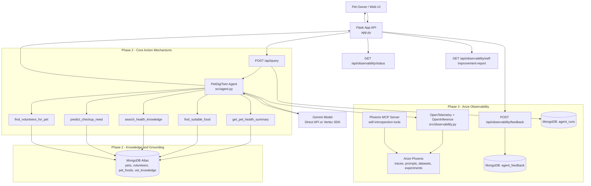

# PetDigiTwin — AI Agent for Pet Health & Care

A Google Gemini-powered agent that provides one-stop pet health solutions: daily health monitoring, nutrition tracking, natural recovery suggestions, proactive checkup alerts, and pet sitter matching for vacation planning.

## Phase 1 Compliance Note

PetDigiTwin is implemented using the **Developer SDK path** from the allowed Phase 1 options.

Selected track:
- Gemini Enterprise Agent Platform SDK for Python (custom agent implementation)

Why this satisfies Phase 1:
- Custom agent logic implemented in `src/agent.py`
- Tool calling architecture implemented in `src/tools.py`
- SDK dependencies declared in `requirements.txt` (`google-genai`, `google-cloud-aiplatform`)
- Environment configuration supports both direct Gemini API and Vertex SDK mode (`USE_VERTEX_SDK` in `.env.example`)

Scope note:
- Agent Builder and Agent Starter Pack are valid alternatives, but not required when one approved path is selected.

## Phase 2 Compliance Note

PetDigiTwin satisfies Phase 2 using the **SDK implementation path** for both action and grounding.

Core Action Mechanisms (Tool Use):
- Agent actions are implemented as callable tools in `src/tools.py`
- Tool-backed endpoints are exposed in `app.py`:
  - `GET /api/food-recommendations`
  - `GET /api/health-knowledge`
  - `GET /api/checkup-prediction`
  - `GET /api/find-volunteers`
  - `POST /api/query` (agent orchestration)

Knowledge and Grounding:
- Grounding source is MongoDB Atlas collections (`pets`, `volunteers`, `pet_foods`, `vet_knowledge`)
- The agent combines retrieved tool outputs with Gemini reasoning before response generation

Program interpretation note:
- If your evaluator requires strictly managed Agent Builder resources, the equivalent mapping is:
  - Agent Builder Extensions  <->  SDK tools in `src/tools.py`
  - Agent Builder Data Stores <-> MongoDB-backed grounding collections

## Phase 3 Compliance Note (Arize)

PetDigiTwin now implements Arize track requirements for observability and self-introspection.

Implemented now:
- OpenInference + OpenTelemetry tracing bootstrap in `src/observability.py`
- Auto-instrumentation for Gemini SDK and Vertex SDK (when packages are available)
- Phoenix export configured via environment variables:
  - `PHOENIX_API_KEY`
  - `PHOENIX_COLLECTOR_ENDPOINT`
  - `ENABLE_ARIZE_TRACING`
  - `OTEL_SERVICE_NAME`
- Runtime introspection endpoints in `app.py`:
  - `GET /api/observability/status`
  - `POST /api/observability/feedback`
  - `GET /api/observability/self-improvement-report`
- Self-improvement loop data capture:
  - query telemetry persisted in `agent_runs`
  - human/judge feedback persisted in `agent_feedback`
  - actionable recommendations generated from error rate, latency, and rating trends

Phoenix MCP server (for runtime introspection tooling):
- Run with `npx @arizeai/phoenix-mcp`
- Connect it in your MCP client config (for example Gemini CLI settings) using your Phoenix credentials

## ✨ Features

- **Health Monitoring** — Daily pet health tracking with anomaly detection
- **Nutrition Guidance** — Personalized food recommendations based on pet conditions
- **Natural Recovery** — Suggest natural remedies for common pet ailments
- **Proactive Checkups** — Predict when pets need veterinary care
- **Volunteer Matching** — Find trusted pet sitters for vacation planning
- **Knowledge Base** — RAG over veterinary information and natural remedies

## 🚀 Quick Start (3-5 Days)

### Prerequisites

- Python 3.11+
- MongoDB Atlas account (free tier)
- Google API key for Gemini
- Google Cloud account (for Cloud Run)

### Local Setup

```bash
# 1. Clone and setup
git clone <repo>
cd petdigitwin
python3 -m venv venv
source venv/bin/activate
pip install -r requirements.txt

# 2. Configure environment
cp .env.example .env
# Edit .env with your MongoDB URI and Google API key

# 3. Initialize database
python3 -c "from src.db import PetDigiTwinDB; db = PetDigiTwinDB(); db.initialize_collections(); db.load_sample_data()"

# 4. Test agent locally
python3 src/agent.py

# 5. Run API server
python3 app.py
# Visit http://localhost:8080/
```

### Deploy to Cloud Run

```bash
# Build and deploy (one command)
gcloud run deploy petdigitwin \
  --source . \
  --platform managed \
  --region us-central1 \
  --set-env-vars MONGODB_URI="<uri>",GOOGLE_API_KEY="<key>" \
  --allow-unauthenticated
```

See [DEPLOYMENT.md](DEPLOYMENT.md) for detailed instructions.

## 🧰 Troubleshooting

If the app starts but the web UI shows no data or MongoDB queries fail, the most common issue is MongoDB Atlas network access.

1. Find the current public IP of the server:

```bash
curl -s https://api.ipify.org
```

2. Add that IP to MongoDB Atlas Network Access as a CIDR entry, for example:

```text
172.182.200.133/32
```

3. If you are running locally or in cloud infrastructure, use the correct outbound IP for that environment. If the IP changes frequently, consider using a VPC peering or a broader Atlas access list for testing.

4. Confirm `.env` contains the right `MONGODB_URI` and `GOOGLE_API_KEY` values.

If you still see no data, check container logs or Flask output for connection / authentication errors.

---

## 📋 Architecture

Standalone architecture doc: [docs/ARCHITECTURE.md](docs/ARCHITECTURE.md)



Data flow summary:
- User actions from the SPA call Flask endpoints.
- The agent executes tool actions (Phase 2 action mechanism) to retrieve live context.
- MongoDB collections provide grounded, queryable source-of-truth data (Phase 2 grounding).
- OpenTelemetry/OpenInference spans are exported to Phoenix for end-to-end trace visibility.
- Feedback and run telemetry power a self-improvement report for iterative quality tuning.
- Final recommendations are returned as API responses and rendered in the UI.

---

## 🛠 Tech Stack (Path 1)

| Component | Technology | Why |
|---|---|---|
| **Agent Runtime** | Google Gemini SDK | Required for hackathon |
| **Data Store** | MongoDB Atlas | Simpler JSON model vs Elasticsearch |
| **Tools** | MCP (Model Context Protocol) | Function calling + tool exposure |
| **Deployment** | Google Cloud Run | Serverless, scales automatically |
| **API** | Flask | Lightweight, fast to setup |

---

## 📁 Project Structure

```
petdigitwin/
├── app.py                      # Flask API server
├── requirements.txt            # Python dependencies
├── Dockerfile                  # Container config
├── .env.example               # Environment template
├── DEPLOYMENT.md              # Full deployment guide
├── README.md                  # This file
└── src/
    ├── __init__.py
    ├── db.py                  # MongoDB: collections + sample data (10 pets, 5 volunteers, etc.)
    ├── tools.py               # 5 MCP tools for Gemini agent
    └── agent.py               # Main agent orchestrator (tool calling loop)
```

---

## 🎯 Sample Queries

```bash
# 1. Health remedy
"Max has been limping for 2 days. What natural remedies can help?"

# 2. Pet sitter search
"I'm going on vacation July 1-15. Find a pet sitter for Bella."

# 3. Food recommendation
"What's the best food for Charlie given his arthritis and diabetes?"

# 4. Checkup prediction
"Tell me about Daisy's health and when she needs her next checkup."

# 5. Volunteer matching
"Find volunteers experienced with Bulldogs for emergency pet care."
```

---

## API Endpoints

### Health Check
```bash
GET /health
```

### Agent Query
```bash
POST /api/query
Content-Type: application/json

{
  "query": "What remedies help with joint pain?",
  "pet_id": "pet_001",           # optional
  "max_iterations": 5            # optional
}
```

### Data Lookups
```bash
GET /api/pets                 # List all pets
GET /api/pets/{id}            # Get pet details
GET /api/volunteers           # List volunteers
GET /api/foods                # List foods
GET /api/knowledge            # List vet knowledge
GET /api/observability/status
POST /api/observability/feedback
GET /api/observability/self-improvement-report
```

---

## ⏱ Timeline (3-5 Days)

### Day 1: Setup
- [ ] Project structure created
- [ ] MongoDB configured (1-2 hours)
- [ ] Google API key obtained (30 min)
- [ ] Database schema defined (1 hour)
- [ ] Sample data loaded (1 hour)

### Day 2: Agent Development
- [ ] MCP tools implemented (2-3 hours)
- [ ] Gemini agent orchestrator built (2-3 hours)
- [ ] Tool calling loop tested locally (1 hour)

### Day 3: API & Deployment
- [ ] Flask API server created (1-2 hours)
- [ ] Docker image built (1 hour)
- [ ] Cloud Run deployment (1-2 hours)

### Day 4-5: Polish & Demo
- [ ] Final testing
- [ ] Create demo script
- [ ] Record demo video (3 min)
- [ ] Buffer for fixes

---

## 🚫 What's NOT Included (Add Later)

These are in the **Path 1 skip list**:

- **Arize** — Skipped for MVP (add week 2 for eval+observability)
- **Fivetran** — Skipped for MVP (add week 3 for auto data syncing)
- **Agent Runtime** — Using Cloud Run instead (simpler)
- **UI Dashboard** — API-only for MVP

---

## 🔧 Troubleshooting

### Check the Public IP
```bash
curl -s https://api.ipify.org
```

### MongoDB Connection Error
```bash
# Check URI format and ensure MongoDB Atlas is accepting connections
# Whitelist your IP in MongoDB Atlas
```

### Google API Key Error
```bash
# Verify key has Generative AI API enabled
# Check key is not rate-limited
```

### Tool Calling Fails
```bash
# Ensure tool schemas match Gemini's expectations
# Try simpler queries first
# Check MongoDB has sample data
```

See [DEPLOYMENT.md](DEPLOYMENT.md) for more.

---

## 📖 Next Steps

**After MVP (weeks 2-3):**

1. Add Arize Phoenix for observability + evaluations
2. Add Fivetran for real-time pet wearable data
3. Add more tools (vet scheduling, emergency alerts)
4. Build simple web UI for pet owners
5. Add user authentication + multi-pet support

---

## 📝 License

This project is licensed under the MIT License. See the [LICENSE](LICENSE) file for details.

---

## 👥 Support

For issues, see [DEPLOYMENT.md](DEPLOYMENT.md) troubleshooting section.

---

## 🎯 For Hackathon Judges

**Why this matters:**
- ✅ **Production-ready** — Deployed on Cloud Run, scales automatically
- ✅ **Real tools** — 5 functional MCP tools called by Gemini agent
- ✅ **Real data** — 10 sample pets, 5 volunteers, nutrition DB, vet knowledge
- ✅ **Fast to MVP** — 3-5 days to working demo
- ✅ **Health-focused** — Helps owners make data-driven pet care decisions
- ✅ **Extensible** — Easy to add real APIs (Fitbit, vet clinic systems, etc.)

**Demo:** Query agent with pet-specific questions → Get personalized recommendations → See tool calls in action.
# petdigitwin
