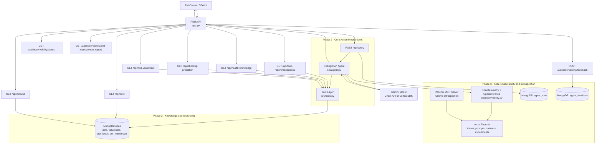

# PetDigiTwin Architecture

This document provides a standalone view of the PetDigiTwin system architecture.

## High-Level Diagram

## Phase 2 Mapping

- Core Action Mechanisms (Tool Use):
  - SDK tools in `src/tools.py` invoked by the agent in `src/agent.py`
  - Tool-facing APIs exposed by `app.py`
- Knowledge and Grounding:
  - MongoDB Atlas collections are the source of truth for pet, food, volunteer, and vet knowledge data
  - Agent responses are grounded with retrieved tool outputs before model reasoning

Managed-platform equivalence (if required by evaluator):
- Agent Builder Extensions  <->  SDK tool layer (`src/tools.py`)
- Agent Builder Data Stores <-> MongoDB grounding collections

## Phase 3 Mapping (Arize)

- Tracing instrumentation:
  - `src/observability.py` initializes OpenTelemetry exporter and OpenInference instrumentors
  - Agent and API spans are emitted from `src/agent.py` and `app.py`
- Phoenix destination:
  - Traces are exported to Phoenix via `PHOENIX_API_KEY` and `PHOENIX_COLLECTOR_ENDPOINT`
- Runtime introspection support:
  - Phoenix MCP server can connect to the same Phoenix project for trace/prompt/dataset introspection
- Self-improvement loop:
  - `agent_runs` captures query-level telemetry
  - `agent_feedback` captures human or judge ratings/comments
  - `/api/observability/self-improvement-report` summarizes trends and recommends tuning actions

## Runtime Flow

1. The user interacts with the SPA served from `/`.
2. The UI calls feature APIs in `app.py`.
3. For AI tasks, `/api/query` invokes `PetDigiTwinAgent`.
4. The agent calls domain tools from `src/tools.py`.
5. Tools fetch and aggregate data from MongoDB Atlas.
6. The agent combines tool output with Gemini model reasoning.
7. Flask returns structured JSON to the UI for rendering.

## Core Components

- API Layer: `app.py`
- Agent Orchestration: `src/agent.py`
- Tooling / business logic: `src/tools.py`
- Persistence: `src/db.py` + MongoDB Atlas
- UI: `src/ui.py`

## Deployment View

- Containerized with `Dockerfile`
- Runs on Google Cloud Run
- Environment-driven model path:
  - `USE_VERTEX_SDK=false`: direct Gemini API key path
  - `USE_VERTEX_SDK=true`: Vertex SDK path
